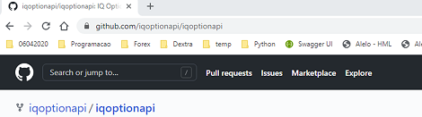
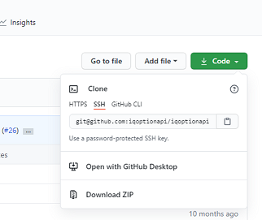
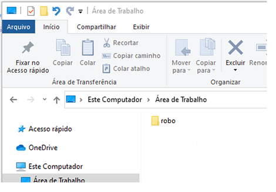
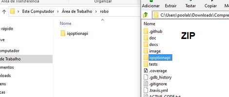
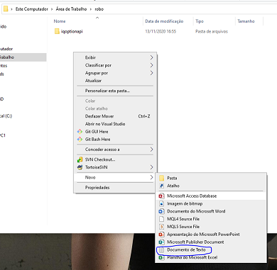
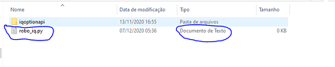
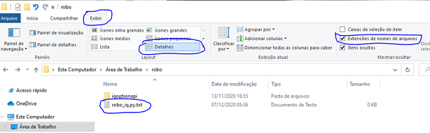
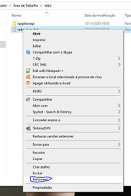
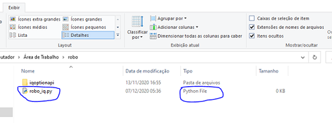

# Começe aqui
***
***
## 1. Preparando o ambiente

    1.1 - Baixe a API mais atual [clicando aqui](http://bit.ly/2Wug9RR).

    1.2. - Faça o dowload do arquivo ZIP.

 

    1.3. - Crie uma nova pasta no seu computador, eu crie essa “robo” na minha area de trabalho e entre nela.

    1.4. - Extrair a pasta “iqoptionapi” inteira de dentro do zip baixado para sua pasta criada.

    1.5. - Crie um arquivo que será o arquivo de seu robo, eu criei o meu como “robo_iq.py”, lembre-se a extensão do arquivo deverá ser “.py”!

>_Atenção: Caso o tipo de arquivo encontrar-se como “Documento de Texto” isso será um problema, então siga esses passos, click em exibir , selecione detalhes, e selecione o checkbox de “Extensões de nomes de arquivos, a extensão verdadeira irá aparecer como na imagem abaixo._

    1.5.1 - Agora renomei o arquivo para a extensão correta, click com o botão direito do mouse no mesmo e escolha renomear e apague a parte “.txt” ficando apenas “robo_iq.py”.

    1.5.2 - Confira o resultado

