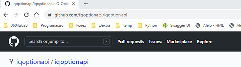
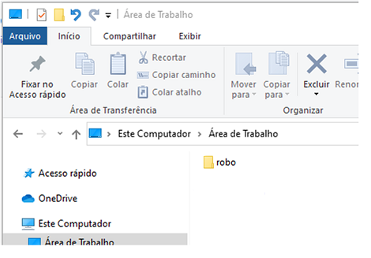
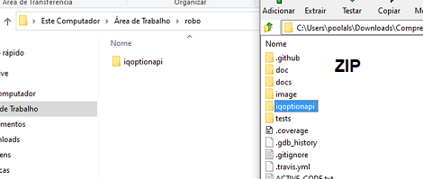
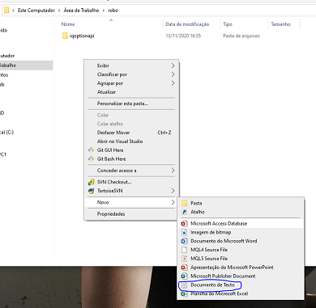
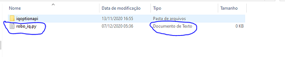
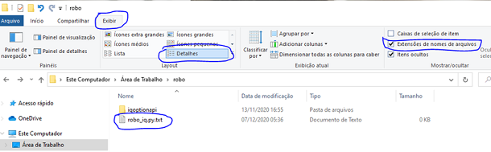
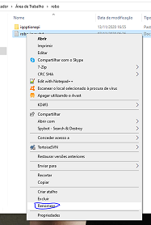
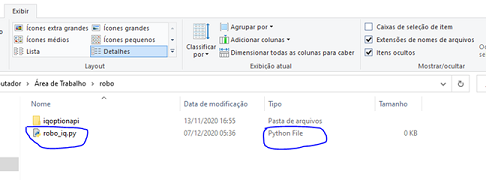
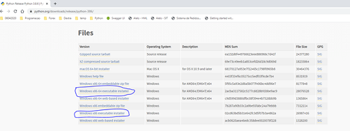
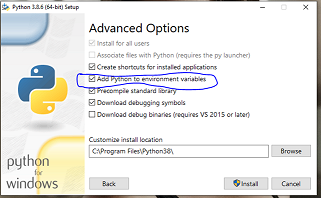

# Começe aqui
***
***
## 1. Preparando o ambiente.

    1.1 - Baixe a API mais atual [clicando aqui](http://bit.ly/2Wug9RR).

    1.2. - Faça o dowload do arquivo ZIP.

 

    1.3. - Crie uma nova pasta no seu computador, eu crie essa “robo” 
           na minha area de trabalho e entre nela.

    1.4. - Extrair a pasta “iqoptionapi” inteira de dentro do zip baixado para sua pasta criada.

    1.5. - Crie um arquivo que será o arquivo de seu robo, eu criei o meu como “robo_iq.py”, 
           lembre-se a extensão do arquivo deverá ser “.py”!

>_Atenção: Caso o tipo de arquivo encontrar-se como “Documento de Texto” isso será um problema, então siga esses passos, click em exibir , selecione detalhes, e selecione o checkbox de “Extensões de nomes de arquivos, a extensão verdadeira irá aparecer como na imagem abaixo._

    1.5.1 - Agora renomei o arquivo para a extensão correta, click com o botão direito do mouse 
            no mesmo e escolha renomear e apague a parte “.txt” ficando apenas “robo_iq.py”.

    1.5.2 - Confira o resultado

## 2. Instalando o python.

    2.1. Acesse a url do python e navegue a a lista de arquivos “Files” e faça o download da vesão 
         de acordo com sua maquina(PC) 64 bits ou 32 bits e execute a instalação da mesma.

[click aqui - python 3.8](https://www.python.org/downloads/release/python-386/)

>_Atenção: No momento da instalação o checkbox “Add Python to enviroment variables" deve esta selecionado._

 

    2.2 - Para testar se tudo deu certo, abra seu cmd ou powershell e digite: python --version
          Algo como na imagem abaixo deverá ser exibido.

## 3. Ultimos passos.

    3.1 - Instalando modulos essenciais.

    Abra seu cmd ou powershell e digite:

    pip install requests
    pip install websocket-client==0.57
    pip install python-dateutil

>_Dica: Você pode rodar o comando "pip freeze" para verificar todos os modulos instalados em sua maquina._

